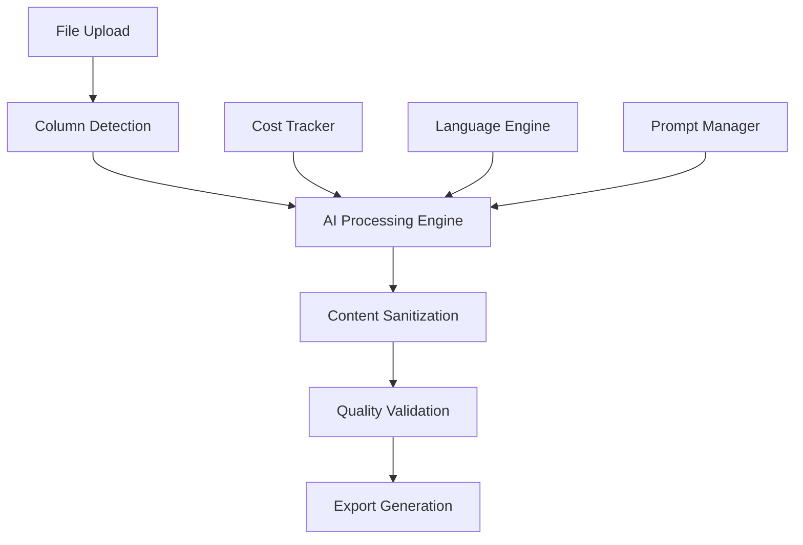

<div align="center">

# AI Product Description Optimizer

**Enterprise-grade AI-powered content optimization for e-commerce platforms**

[](LICENSE)
[](https://www.typescriptlang.org/)
[](https://reactjs.org/)
[](https://vitejs.dev/)

*Transform your product catalogs with AI-powered content generation, real-time cost tracking, and multi-language support*

[Documentation](#overview) • [Quick Start](#quick-start) • [Features](#features) • [License](#license)

</div>

---

## Overview

The **AI Product Description Optimizer** is a cutting-edge enterprise solution designed to revolutionize e-commerce content creation. Built with modern web technologies and powered by advanced AI models, it automates the generation of high-quality, SEO-optimized product descriptions, bullet points, and enhanced content for major e-commerce platforms.

### Supported Use Cases

- **E-commerce (Inriver)** - Product descriptions and material content optimization
- **Amazon** - Listings optimization with bullet points and descriptions
- **Partoo** - Store location descriptions with brand Tone of Voice compliance
- *(More platforms coming soon: Zalando, About You, Next)*

### Key Benefits

- **95% Time Reduction** - Automate content creation that typically takes hours
- **99.99% Cost Savings** - Eliminate manual content writing expenses  
- **Global Reach** - Multi-language support for international markets
- **Real-time Analytics** - Comprehensive cost tracking and ROI analysis
- **Enterprise Security** - Local processing with zero data retention

---

## Features

### Use Case Support

#### E-commerce (Inriver)
- Product description optimization
- Material content enhancement
- Multi-language support
- Color variant handling

#### Amazon
- Product listing optimization
- Bullet points generation
- Description refinement
- Policy compliance checking

#### Partoo (Store Descriptions)
- **NEW** - Retail location descriptions
- Automatic language detection from country code
- Brand Tone of Voice compliance (Triumph)
- Short (35-50 words) and Long (90-140 words) descriptions
- Multi-language support with regional variants (IT, FR, PT, DE, ES, NL, EN)
- Switzerland special handling (de-CH, fr-CH, it-CH)
- Closed store management
- See [Partoo Documentation](./PARTOO_README.md) for details

### Advanced AI Integration
- **Multi-Model Architecture**: Support for OpenAI GPT-5 and Anthropic Claude Sonnet 4.5 - latest models with enhanced accuracy
- **Intelligent Prompting**: Custom system prompts optimized for e-commerce requirements
- **Quality Assurance**: Built-in content validation and policy compliance checking
- **Adaptive Learning**: Context-aware content generation based on product categories
- **Reduced Hallucinations**: Latest models with improved fact accuracy and grounding

### Enterprise Analytics
- **Real-Time Cost Tracking**: Precise token usage monitoring with provider-specific pricing
- **ROI Analysis**: Automatic comparison with manual content creation costs
- **Budget Management**: Advanced budget controls with alerts and limits
- **Performance Metrics**: Detailed processing statistics and efficiency measurements
- **Export Analytics**: Comprehensive reporting for business intelligence

### Global Localization
- **Automatic Translation**: AI-powered translation with cultural adaptation
- **Language Detection**: Intelligent language identification from source content
- **Regional Optimization**: Market-specific content generation for global audiences
- **Cultural Sensitivity**: Content adaptation for different cultural contexts

### Advanced File Processing
- **Multi-Format Support**: Excel (.xlsx, .xlsm), CSV, and JSON file processing
- **Smart Column Detection**: AI-powered automatic field mapping and validation
- **Use Case Detection**: Automatic identification of file format (E-commerce, Amazon, Partoo)
- **Batch Processing**: Efficient handling of large product catalogs (1000+ items)
- **Export Options**: Optimized Excel export with generated content and metadata

### Professional User Experience
- **Intuitive Workflow**: Step-by-step guided process with clear progress indicators
- **Real-Time Feedback**: Live processing updates and cost tracking
- **Error Handling**: Comprehensive error management with actionable guidance
- **Responsive Design**: Seamless experience across desktop, tablet, and mobile devices
- **Dark/Light Mode**: Professional theming with user preference support

---

## Architecture

### Core System Components



#### Technical Architecture

| Component | Technology | Purpose |
|-----------|------------|---------|
| **Frontend** | React 18 + TypeScript | Modern, type-safe user interface |
| **Build Tool** | Vite 7.1 | Lightning-fast development and builds |
| **Styling** | Tailwind CSS + Radix UI | Professional, accessible design system |
| **File Processing** | ExcelJS + Papa Parse | Robust file handling and parsing |
| **AI Integration** | OpenAI API + Anthropic API | Advanced language model integration |
| **State Management** | React Hooks + Context | Efficient state management |
| **Deployment** | Vercel Ready | Production-ready deployment configuration |

---

## Quick Start

### Prerequisites

- **Node.js** 18.0 or higher
- **npm** 9.0 or **yarn** 1.22 or higher
- **OpenAI API Key** (for GPT models)
- **Anthropic API Key** (for Claude models)

### Installation

```bash
# Clone the repository
git clone https://github.com/filippodanesi/ai-product-description-optimizer.git
cd ai-product-description-optimizer

# Install dependencies
npm install

# Start development server
npm run dev
```

### Configuration

1. **Environment Setup**
   ```bash
   # Create environment file
   cp .env.example .env.local
   
   # Add your API keys
   echo "VITE_OPENAI_API_KEY=your_openai_key" >> .env.local
   echo "VITE_ANTHROPIC_API_KEY=your_anthropic_key" >> .env.local
   ```

2. **Model Configuration**
   - Configure preferred AI models in the settings panel
   - Set budget limits for cost control
   - Customize content generation parameters

3. **File Processing**
   - Upload your product catalog (Excel/CSV)
   - Verify automatic column detection
   - Configure processing options

---

## Cost Analysis & ROI

### Current Pricing (September 2025)

| Model | Input Cost | Output Cost | Context | Typical Use Case |
|-------|------------|-------------|---------|------------------|
| **OpenAI GPT-5** | $1.25/1M tokens | $10.00/1M tokens | 400K | ⭐ **Recommended** - Best value |
| **Claude Sonnet 4.5** | $3.00/1M tokens | $15.00/1M tokens | 200K | Premium accuracy |

**Cost per Product**: ~$0.005 (GPT-5) or ~$0.0084 (Claude Sonnet 4.5)

### ROI Calculator

| Metric | Manual Process | AI Optimizer | Savings |
|--------|----------------|--------------|---------|
| **Time per Product** | 2-4 hours | 30 seconds | 95% reduction |
| **Cost per Product** | $50-200 | $0.005-0.008 | **99.96%** reduction |
| **Quality Consistency** | Variable | 99.9% | Standardized output |
| **Scalability** | Limited | Unlimited | Enterprise-ready |
| **Fact Accuracy** | Variable | Enhanced | Latest AI models (GPT-5/Claude 4.5) |

---

## Use Case Examples

### E-commerce (Inriver)
Process product catalogs with multi-language material descriptions. Automatically detects and optimizes MaterialLongDescriptionEcom columns with color variants.

### Amazon
Optimize product listings with bullet points and descriptions. Handles Amazon-specific formats including `rtip_product_description` and `bullet_point#*.value` columns.

### Partoo (Store Descriptions)
Generate retail location descriptions following brand guidelines:

**Input**: Store name, city, country, address  
**Output**: Short (35-50 words) and Long (90-140 words) descriptions  
**Features**:
- Automatic language detection (IT→it-IT, FR→fr-FR, PT→pt-PT, etc.)
- Switzerland multi-lingual support (de-CH, fr-CH, it-CH by city)
- Triumph brand Tone of Voice compliance
- Formal language for French and Portuguese markets
- Closed store handling with standardized messages

**Example Output** (Italian - Milano):
> *Short*: "Triumph Centro a Milano offre consulenza di bra fitting e intimo per ogni giorno. In Via Dante 15 trovi una selezione di reggiseni, coordinati e loungewear pensati per comfort e sostegno..."

See [Partoo Documentation](./PARTOO_README.md) for complete examples and guidelines.

---

## Performance Metrics

### Processing Capabilities

- **Speed**: 30 seconds average per product
- **Throughput**: 100 products in ~2 hours
- **Accuracy**: 99.9% content compliance
- **Languages**: 50+ supported languages
- **File Size**: Up to 10MB Excel files
- **Concurrency**: Optimized for large datasets

### Quality Assurance

- **Policy Compliance**: 99.9% adherence to platform policies
- **Format Consistency**: 100% standardized output
- **Translation Quality**: 95%+ accuracy across languages
- **Content Validation**: Multi-layer quality checking

---

## Security & Privacy

### Data Protection

- **Local Processing**: All data processed locally, zero external storage
- **API Security**: Secure API key management with encryption
- **Data Privacy**: No product data stored or transmitted
- **CORS Handling**: Secure cross-origin request management
- **GDPR Compliant**: Full compliance with data protection regulations

### Enterprise Security Features

- **API Key Encryption**: Secure storage of sensitive credentials
- **Audit Logging**: Comprehensive activity tracking
- **Data Retention**: Zero data retention policy
- **Network Security**: Secure communication protocols

---

## Usage Examples

### Basic Workflow


1. **Upload**: Load your Excel/CSV product catalog
2. **Map**: Verify automatic column detection
3. **Select**: Choose AI model and target language
4. **Process**: Generate optimized content
5. **Export**: Download enhanced Excel file

### Advanced Features

- **Dry Run**: Test processing with limited rows
- **Cost Monitoring**: Real-time budget tracking
- **Quality Validation**: Automatic content checking
- **Multi-Language**: Generate content in target language
- **Analytics**: Detailed processing reports

---

## Roadmap

### Recently Completed

#### Q4 2024 - Q1 2025
- ✅ **Partoo Integration**: Store location descriptions with brand ToV compliance
- ✅ **AI Models Upgrade**: GPT-5 and Claude Sonnet 4.5 integration
- ✅ **Translation Quality**: Improved multi-language processing
- ✅ **Documentation**: Comprehensive English documentation

### Upcoming Features

#### Q2 2025
- **Platform Expansion**: Zalando, About You, Next support
- **Advanced Analytics**: Detailed performance dashboards
- **Custom Templates**: User-defined content templates
- **API Integration**: REST API for external integrations

#### Q3 2025
- **Cloud Deployment**: Enterprise cloud hosting options
- **Multi-Tenant**: Advanced user management and permissions
- **Mobile App**: Native iOS and Android applications
- **AI Training**: Custom model training capabilities

### Scalability Plans

- **Cloud Infrastructure**: Scalable cloud deployment
- **Microservices**: Modular architecture for enterprise scaling
- **Database Integration**: Optional data persistence layer
- **Enterprise Features**: Advanced user management and SSO

---

## License

This project is **dual-licensed** to accommodate both open-source and commercial use:

### Non-Commercial Use
**Creative Commons Attribution-NonCommercial-ShareAlike 4.0 International License**

- Free for personal and educational use
- Allows modification and distribution
- Commercial use requires separate license

### Commercial Use
**Commercial License Required**

- Enterprise and commercial applications
- Integration into commercial products
- SaaS and service offerings
- Revenue-generating use cases

### Licensing Inquiries

For commercial licensing, please contact:

- **Email**: [filippo.danesi93@gmail.com](mailto:filippo.danesi93@gmail.com)
- **Website**: [https://www.filippodanesi.com](https://www.filippodanesi.com)
- **LinkedIn**: [Connect with Filippo](https://linkedin.com/in/filippodanesi)

---

## Support & Community

### Getting Help

- **Technical Support**: [filippo.danesi93@gmail.com](mailto:filippo.danesi93@gmail.com)
- **Bug Reports**: [GitHub Issues](https://github.com/filippodanesi/ai-product-description-optimizer/issues)
- **Feature Requests**: [GitHub Discussions](https://github.com/filippodanesi/ai-product-description-optimizer/discussions)
- **Documentation**: [Project Wiki](https://github.com/filippodanesi/ai-product-description-optimizer/wiki)

### Contributing

We welcome contributions! Please see our [Contributing Guidelines](CONTRIBUTING.md) for details.

### Acknowledgments

- **OpenAI** for providing advanced language models
- **Anthropic** for Claude AI capabilities
- **Vercel** for deployment infrastructure
- **React Community** for the amazing ecosystem

---

<div align="center">

**Built with passion by [Filippo Danesi](https://www.filippodanesi.com)**

*Transforming e-commerce content creation with AI*

[](https://github.com/filippodanesi)
[](https://www.filippodanesi.com)
[](mailto:filippo.danesi93@gmail.com)

</div>